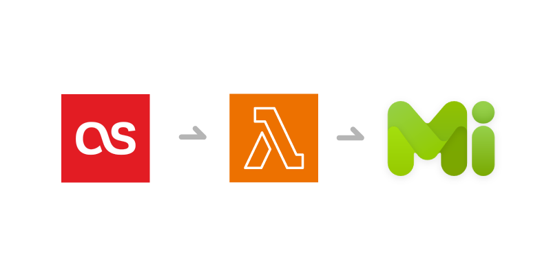

---
---

# lastfm-my-weekly-chart-lambda

  

## 概要
Last.fm にて記録している音楽視聴の履歴から1週間でよく聞いた曲を、MisskeyというSNSに投稿できる関数を作りました。

## 公開先
[GitHub](https://github.com/prismistim/lastfm-my-weekly-chart-lambda)

## 技術スタック
- Serverless Framework
  - AWS Lambda
  - AWS EventBridge
- TypeScript
- ESBuild
- ESLint
- Prettier
- dotenv
- misskey-js

## 背景
元々、`my-weekly-chart` というサービスを利用していて、Twitterと連携することで毎週同じように投稿ができていたのですが、長くメンテナンスされていないことや、APIの有料化もあり、気づけば動かなくなっていました。

基本的にLast.fmのAPIから取得して、それを投稿するというシンプルなものなので、自分で作ってみるかと思い、開発をはじめました。

## Serverless Framework での開発
Serverless Framework は、以前から名前ぐらいは知っていたのですが、実際につかったことがなかったので、今回使用しました。

Lambda と EventBridge しか使わなかったので、最小構成ではあるんですが、CDKと同じような感覚（CDKより簡単かも？）で環境ができ、デプロイまでコマンド一つでできてしまうのは素晴らしいですね。

## 感想
素でESBuildを使ったことがなかったのでなんとなくで使ってみましたが、Serverless Framework 側にもESBuild用のプラグインが用意されていたので、意外とあっさりできました。

## 今後
現状、CIを作ったりしているわけではないので、ローカルでビルドしてそのままデプロイしていますが、そのうちGitHub Actionsなどでデプロイまで一括してできるようにしたいです。